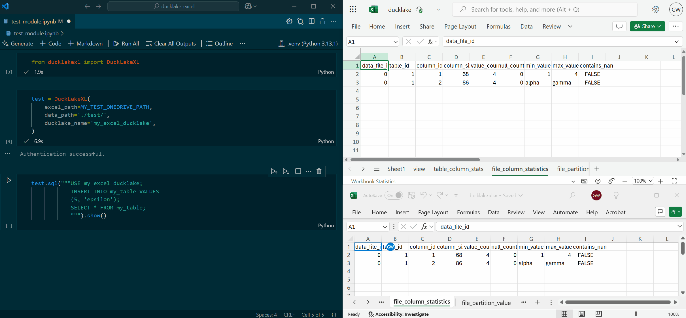

#  DuckLakeXL

> [!CAUTION]
> This package is based on taking a stupid idea way too far. It is not suited for production use, but may have some paedogogical utility. Or you may just find it fun to mess around with. It is slow, non-ACID, and all around silly. 

This package allows the use of Excel (as a local file or on OneDrive/SharePoint) as a catalog database for [DuckLake](https://ducklake.select/), using the [ducklake extension](https://duckdb.org/docs/stable/core_extensions/ducklake) in DuckDB.



## Why???

DuckLake (re-)[^1]implements a catalog for a lakehouse architecture by leveraging commonly-used database management systems (DBMS) like PostreSQL or SQLite. 

However, the initial implementation of the extension left out the **GOAT** of DMBSs: Excel workbooks. Anyone who has worked for more than 5 minutes in an enterprise more than 30 miles outside San Fransisco know that the vast majority of information in the enterprise is cataloged and transacted via Excel spreadsheets. And if you're lucky, these spreadsheets are accessible to more than one person at a time via platforms like SharePoint.

The pre-modern data stack is built on a foundation of Excel workbooks, SharePoint folders, and network drives. It is only fitting that users constrained to this stack get the benefit of modern data lake concepts and open table formats.  

[^1]: Many have noted that it's perhaps a recapitulation of the Hive metastore concept

## How?

Though it would have been nice to directly attach to an Excel file, the official [Excel Extension](https://duckdb.org/docs/stable/core_extensions/excel.html) doesn't even do that, so what hope did this silly project have?

The architecture used is a sync between a local DuckDB-backed ducklake instance and a "remote" Excel copy of the ducklake metadata tables. Every `sql` operation against the `DuckLakeXL` instance passes the query through to an underlying DuckDB connection, to which the DuckLake has been attached. The calls to the DuckDB connection are wrapped with syncing operations to (1) ensure that the local copy of the metadata is updated with the latest version of the remote before executing the query and (2) propagate any changes to the Excel remote after the operation completes. 

Is this a robust and reliable approach? No way! Is it a practical way to persist a DuckLake metadata in Excel with minimal effort on the implementation side? Yeah. 

In a world of single-user, using a local Excel file, where we got lucky and nothing ever failed mid-transaction, this would give you a reasonably reliable method. When we get into multiple HTTP requests against OneDrive or Sharepoint that need to all succeed to maintain valid state... things start to get iffy. When we then consider multiple users potentially running concurrent operations against a OneDrive/Sharepoint remote, that opens up all the concurrency and conflict management problems that DuckLake solves by usnig a real DBMS with transactional behavior, like PostgreSQL, that are designed around those kind of problems. While it would be a waste of time and effort to fully solve them for this project, there are probably ways to nibble around the edges and make it incrementally more capable of (but let's remember, not well-suited for!) this kind of usage over time. 

## Usage

So far, it is only implemented and tested against OneDrive. Other modalities coming soon.

```python
# if running from a Jupyter session, you may need to run these two lines invoking nest_asyncio
# so the async event loop in DuckLakeXL won't conflict with the Jupyter kernel's event loop
import nest_asyncio # needed when calling from Jupyter
nest_asyncio.apply()

from ducklakexl import DuckLakeXL

# Create a DuckLakeXL instance
db = DuckLakeXL(
    excel_path=MY_ONEDRIVE_PATH,
    data_path='/path/to/local/or/network/directory/',
    ducklake_name='my_excel_ducklake',
)

# Execute SQL calls thusly
db.sql("""USE my_excel_ducklake;
        CREATE TABLE my_table(id INTEGER, val VARCHAR);
        INSERT INTO my_table VALUES
        (1, 'Excel Rules!');
        """) 

# the sql method just returns the DuckDB result of the sql method, 
# so you can invoke any of its methods:
db.sql("""SELECT * FROM my_table""").show()
my_df = db.sql("""SELECT * FROM my_table""").df()
```

For personal OneDrive usage, the `MY_ONEDRIVE_PATH` parameter should be a string of the form  `A123456789ABCDEF!s0123456789abcdef0123456789abcdef`. You can find this identifier by opening your Excel file in the browser in OneDrive, and looking up the `resid` parameter, as in: `https://onedrive.live.com/personal/a123456789abcdef/_layouts/15/Doc.aspx?resid=`**`A123456789ABCDEF!s0123456789abcdef0123456789abcdef`**`&cid=a123456789abcdef&migratedtospo=true&app=Excel` 

When implemented, details for `excel_path` inputs that auto-detect and connect to the appropriate source will be added here.

### OneDrive/SharePoint Setup

You need to register an app with Entra ID in your (organization's) Azure Portal. That enables programatic API calls against the Microsoft Graph endpoints, with delegated permissions, and ability to use `Files.ReadWrite` and `User.Read` scopes.

🚧 Details coming here ... 🚧

## TODOs

No commitment is made that any of these actually get done. However, PRs are welcome.

- [ ] Local `xlsx` file
- [x] OneDrive
- [x] OneDrive API calls async-ify
- [ ] Make it ACID (one-drive)?
    - Lazy way: 
        - A semafore strategy on a separate sheet
    - Better way: 
        - Abstract out an append-only SCD-style version of each ducklake table. 
        - Convert into/out of that to current version of each table as needed.
        - Robustness against case where new lines appended concurrently?
- [ ] Ensure functionality for SharePoint matches that on OneDrive 
- [ ] Logging - optionally pass in a user-provided logger as parameter
- [ ] Logging - use logger
- [ ] On push, only write changed tables
    - Cache ducklake tables on pull, compare before push to identify changes
    - More CDC/wal way to do it? Maybe take advantage of `ducklake_name.snapshots()` function
    - Just append instead of clear and write, where applicable
- [ ] Meta-time-travel by leveraging file versions stored on OneDrive/SharePoint?
    - This could be a way to roll back on ACID-related issues above, if we fail mid-transaction
- [ ] Validate use of a network share (mounted or not) as a `data_path`
- [ ] Is it possible to use SharePoint as the data path?
    - Possibly if we have OneDrive syncing
    - Probably not via Graph API
- [ ] Tests
- [ ] CI/CD
- [ ] Publish to pypi?